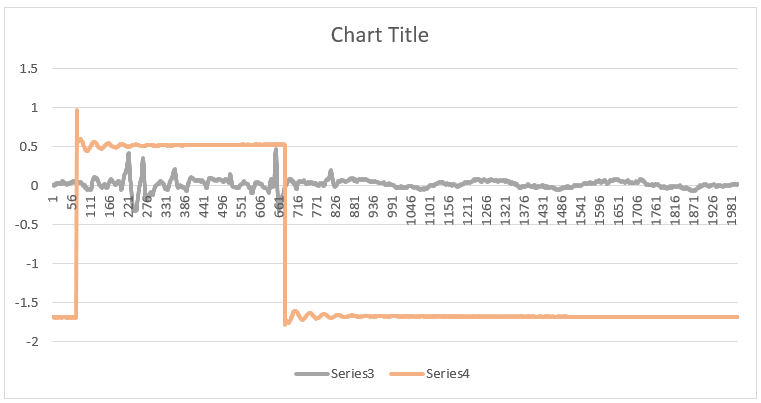
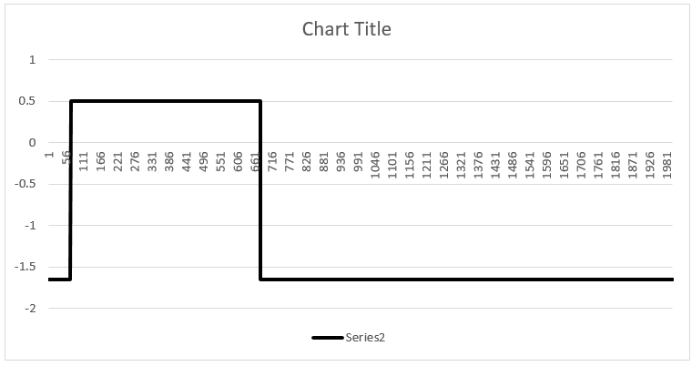
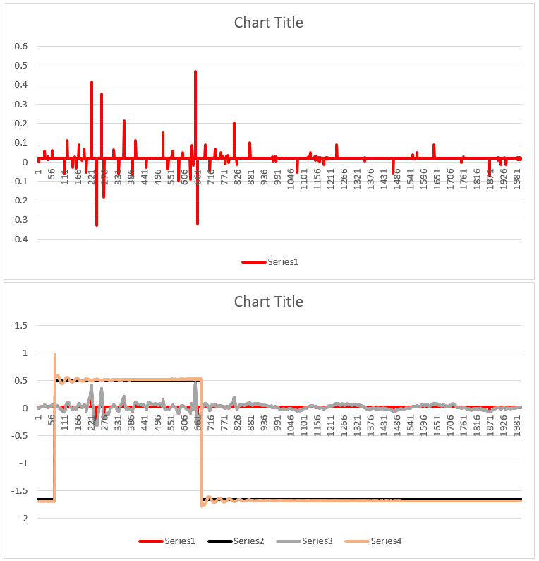
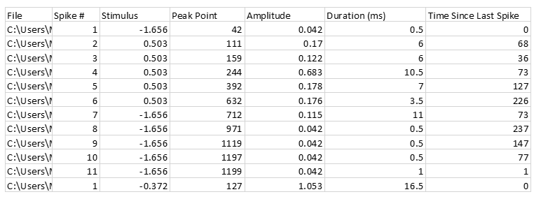

# legUp

## What it is
legUp is a short program written in Python 3 which will examine a folder of .csv files and produce a summary of their data. The files are generated during electrophysiological recording of cockroach legs while the spines are stimulated. The raw data consists of a series of paired readings, one representing the stimulus and the other the electrophysiological recording (the output). The files are created during an 0.1s recording and contain one data point per 0.05ms for a total of 2,000 data points for stimulus and response.

A Java program is provided for analysing the files in graph form, but manually locating the spikes and calculating their amplitudes, durations, and relative onset times can be laborious. The job of legUp is to provide these readings for you so that you can identify spikes by onset time alone and simply read off the rest of the data.

## How to use it
Download [legUp_v2.zip](https://github.com/mjaquiery/legUp/raw/master/legUp_v2.zip) and extract it to a sensible location.

Run legUp_v2.exe located in the dist folder (.../legUp_v2/dist/legUp_v2.exe). Follow the onscreen instructions.

## How it works
The program first generates a list of all of the .csv files in a folder and that folder's subfolders. For each file in this list it does the following:
* Process the file and store the raw values therein. If you were to make a graph of the file at this point you would get the graph you would normally be analysing 
            
* Next, the program performs some aggressive normalisation on the data. The stimulus data (orange line in the chart above) is split into two halves either side of the mean for the entire file. Values are then converted to be equal to the mode (most frequent score) within their respective halves. This provides a flattening effect which effectively reduces the ringing clearly visible at the start and end of stimulus application. The new stimulus data can be seen below in black 
            
* The next step performs a different kind of filtering on the response data. The mean of the entire file is taken as a baseline, and the program then isolates the most extreme point reached before the baseline is crossed. All other values are set to the baseline value (to preserve the time differences necessary for assessing the duration). The filtered data plot is shown below, and below that a combined graph showing all four lines 
            
* Once the data has been processed in this manner the program steps sequentially through the response deflections and for each new deflection it checks to see if the next deflection is roughly equal in magnitude and of a different sign. If successful, those two deflections are categorised as a spike and the relevant data recorded and written to an output file. The output looks as follows 
            
  
## The output file
When you open your output file you will see a long table with 7 columns (the columns are shown in the image above). The file column is the name of the file the results of that column belong to. The spike # column tells you what number the spike is within the file it was found. The stimulus column reports the value of the stimulus at the point the spike started (this is the aggressively averaged value mentioned earlier, not the raw value). The peak point column indicates the time (in half milliseconds, i.e. the data point) corresponding to the spike's first deflection peak. The amplitude and duration report those properties, and the time since last spike reports the time between the peak point of the previous spike and the peak point of the current spike. For the first spike in a file the time since last spike is reported as zero.  

Files which produced no spikes recognisable by the program are not included in the output file.

The data yielded by this program are designed to save you time. They cannot be used as a substitute for analysing the original graphs, but they can greatly reduce the time required to interrogate specific areas of interest within those graphs.

## Further information
If you have any queries or concerns contact Guy Richardson or me ([matt.jaquiery@psy.ox.ac.uk](matt.jaquiery@psy.ox.ac.uk)).

Matt Jaquiery, 2015